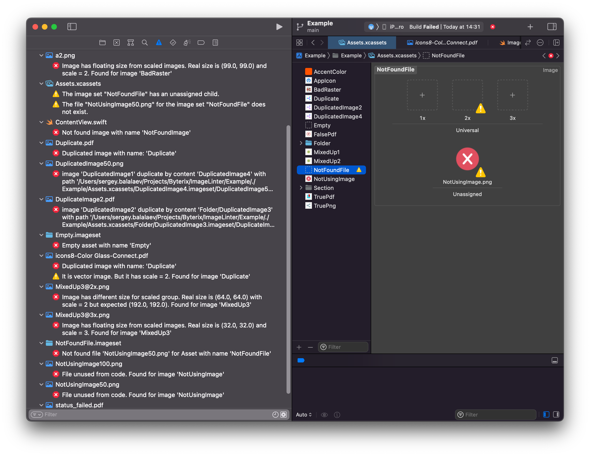
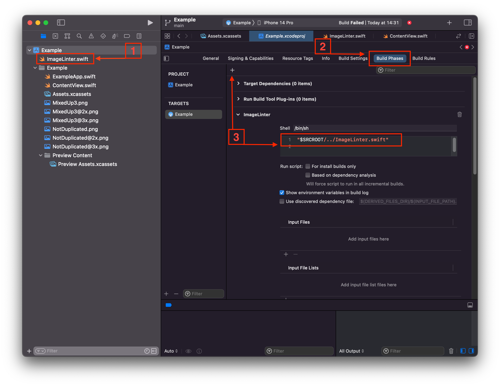

# ImageLinter

Check image files and resources for Swift

## Script allows

 1. Checking size of vector(PDF) and rastor(PNG/JPEG) files
 2. Catch raster from PDF
 3. Checking unused image files
 4. Search undefined images
 5. Comparing scaled images size
 6. Checking duplicate images by name
 7. Checking duplicate images by content (but identical)
 8. Search empty and broken asset images



## Accessibility

1. Possible analyse the sources (swift, Objective-C files) and resources (Storyboard, xib files)
2. Support Assets and files with @Xx notation
3. vector/rastor diffenition and you can limit use formats by PNG, JPG, PDF, SVG, etc formats
4. Support any use notation: SwiftUI, UIKit, SwiftGen, and custom Regex
5. You can ignore any images
6. Any settings for generation errors or warnings

## Install

1. Just copy ImageLinter.swift to project.
2. Exclude from "Build Phases" -> "Compile Sources"
3. Add to "Build Phases" run script: 
```bash
${SRCROOT}/ImageLinter.swift -imagesPath "/YouProject/Resources/Images" -sourcePath "/YouProject/Source"
```


## Setup:

```swift

/// yuo can use many types
let usingTypes: [UsingType] = [
    .swiftUI, .uiKit
]

/**
 If you want to exclude unused image from checking, you can define they this

 Example:
  let ignoredUnusedImages = [
     "ApplicationPoster"
  ]
 */
let ignoredUnusedImages: Set<String> = [
	"AppIcon"
]
let ignoredUndefinedImages: Set<String> = [
	"ReadMe.PDF"
]

let rastorExtensions = ["png", "jpg", "jpeg"]
let vectorExtensions = ["pdf", "svg"]
let rastorSetExtensions = Set<String>(rastorExtensions.map{$0.uppercased()})
let vectorSetExtensions = Set<String>(vectorExtensions.map{$0.uppercased()})
let imageSetExtensions = rastorSetExtensions.union(vectorSetExtensions)

let sourcesExtensions = ["swift", "mm", "m"]
let resourcesExtensions = ["storyboard", "xib"]
let sourcesSetExtensions = Set<String>(sourcesExtensions.map{$0.uppercased()})
let resourcesSetExtensions = Set<String>(resourcesExtensions.map{$0.uppercased()})

// If you wan't show double errors/warnings for all files of an image change this to false
let isAllFilesErrorShowing = false

// Maximum size of Vector files
let maxVectorFileSize: UInt64 = 20_000
let maxVectorImageSize: CGSize = CGSize(width: 100, height: 100)

// Maximum size of Rastor files
let maxRastorFileSize: UInt64 = 200_000
let maxRastorImageSize: CGSize = CGSize(width: 1000, height: 1000)

let isCheckingFileSize = true
let isCheckingImageSize = true
let isCheckingPdfVector = true
let isCheckingSvgVector = true
let isCheckingScaleSize = true
let isCheckingDuplicatedByName = true
let isCheckingDuplicatedByContent = true
```

## Example

You can review 
