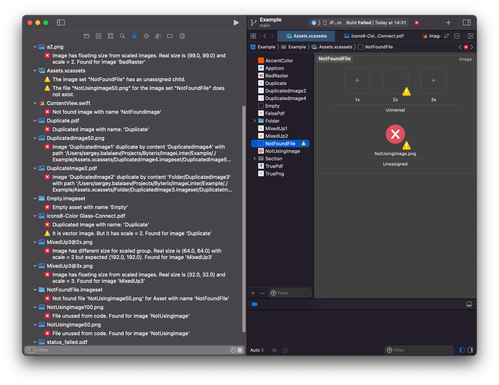
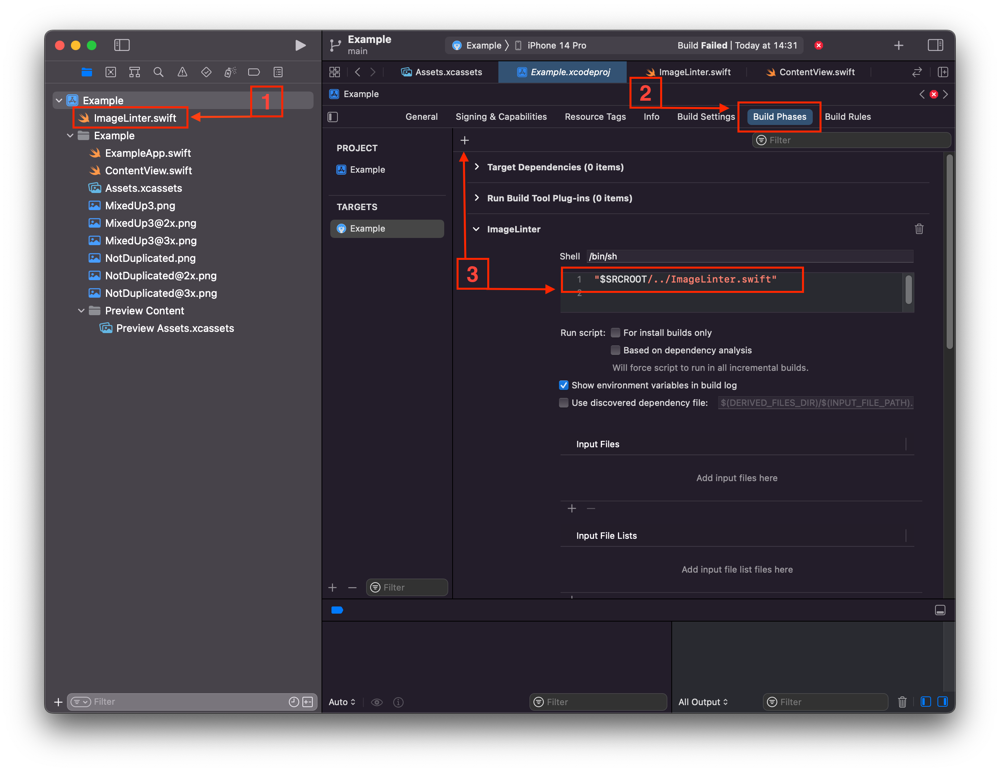

# ImageLinter

Check image files and resources for Swift

## Script allows

 1. Checking size of vector(PDF) and rastor(PNG/JPEG) files
 2. Catch unwanted raster from PDF or SVG (vector files)
 3. Checking unused image from sources files
 4. Search undefined images from resources
 5. Comparing scaled images size
 6. Checking duplicate images by name
 7. Checking duplicate images by content (but binary identical)
 8. Search empty and broken asset images
 9. Analysis scales of images with dependency on platforms target
 10. Checking the name of images with convensions or custom patterns apply filters



## Accessibility

1. Possible analyse the sources (swift, Objective-C files) and resources (xcassets, Storyboard, xib files, images files)
2. Support xcassets and images files with @Xx notation
3. vector/rastor diffenition and you can limit use formats by PNG, JPG, PDF, SVG, etc formats
4. Support any use notation: SwiftUI, UIKit, SwiftGen, and custom Regex
5. You can ignore any images or sources use if need
6. Any settings for generation errors or warnings with different filters

## Install

### Swift Package Manager (SPM)

The [Swift Package Manager](https://swift.org/package-manager/) is a tool for automating the distribution of Swift code and is integrated into the `swift` compiler. `Imagelinter` supports its use on supported platforms as plugin tool. 

Once you have your Swift package set up, adding `Imagelinter` as a dependency is as easy as adding it to the `dependencies` value of your `Package.swift`. Then you need call from your target plugin like this:

```swift

    dependencies: [
        .Package(url: "https://github.com/ByteriX/Imagelinter.git", majorVersion: 2)
    ],
    targets: [
        .target(
            name: "YourTarget",
            plugins: [
                .plugin(name: "ImagelinterPlugin", package: "Imagelinter"),
            ]
        )
    ]
    
```

### Swift script from Build Phases

1. Just copy ImageLinter.swift to project.
2. Exclude from "Build Phases" -> "Compile Sources"
3. Add to "Build Phases" run script: 
```bash
${SRCROOT}/ImageLinter.swift
```


## Settings:

You need to add a settings file named `imagelinter.yaml` or/and `imagelinter.yml` to a `target` or/and `the root of the library` `dir` of the package.
imagesPath and sourcePath are calculated from dir of this package. 

Supports more settings files with rewrite properties with priority: first a `target` then `the root` of library dir, first `imagelinter.yaml` then `imagelinter.yml`.
If you want to have a custom path to settings file, you can use `--settingsPath [path to your imagelinter.yaml or imagelinter.yml file]` command line param from script call only on build phase. In the plugin this would be set to target dirrectory all time.

### How to setting up your yaml file

**isEnabled** - turn on/off working of this plugin/script. Is boolean param with `true` \ `false` value. Default is `true`. Example:
```yaml
isEnabled: true
```

**relativeImagesPath** (*deprecated*) please use array of path `relativeImagesPaths`. Now you can use jointly `relativeImagesPaths`. From 2.0 version will be removed. Example:
```yaml
relativeImagesPath: /Sources/Images/Resource1
relativeImagesPaths:
  - /Sources/Images/Resource2
  - /Sources/Images/Resource3
```

**relativeImagesPaths** array of paths to directory that contains xcassets and images files of project. Example:
```yaml
relativeImagesPaths:
  - /Sources/Images/Resource2
  - /Modules/Module1/Images
  - /Modules/Module2/Images
```
Please don't contents name of .xcassets or images files to path. Path should reference directory who content images files or xcassets. Examples:
**⛔ How not to do it:**
```yaml
relativeImagesPaths:
  - /Resources/Images/Catalog.xcassets
  - /Resources/Images/Icon.png
```
**✅ As it should be:**
```yaml
relativeImagesPaths:
  - /Resources/Images/
```

**relativeSourcePath** (*deprecated*) please use array of path `relativeSourcePaths`. Now you can use jointly `relativeSourcePaths`. From 2.0 version will be removed. Example:
```yaml
relativeSourcePath: /Main/src
relativeSourcePaths:
  - /Module1/src
  - /Module2/src
```

**relativeSourcePaths** array of paths to directory that contains files with a source code of project which use images. Please don't contents name of files to path. Example:
```yaml
relativeSourcePaths:
  - /Sources/
  - /Modules/Module1/Sources
  - /Modules/Module2/Sources
```
Please don't contents name of sources files to path. Path should reference directory who content sources files. Examples:
**⛔ How not to do it:**
```yaml
relativeSourcePaths:
  - /Sources/View/ContentView.swift
  - /Sources/Utils.c
```
**✅ As it should be:**
```yaml
relativeSourcePaths:
  - /Sources/
```

**usingTypes** - array of ways to use images from sources. You can use pre-installed case or/and make your regular expressions to match with your a way to use images.
##### cases:
**swiftUI** - when you use images from initializer Image. Example:
```swift
VStack {
    Image("picture")
}
```
**uiKit** - when you use images from initializer UIImage. Example:
```swift
let img = UIImage(named: "picture")
```
**uiKitLiteral** - when you use images from literal. Examples:
```swift
Image(uiImage: 🖼)  // SwiftUI
let uiKitPicture = #imageLiteral(resourceName: "picture")
```
**swiftGen** - when you use images from constants generated by xcodegen utilite. This option has parameter `enumName` - root name of images asset. Default is `Asset`. 

###### Examples of use in settings:
```yaml
usingTypes:
  - case: swiftGen # with default enumName
  - case: swiftGen # with custom enumName
    enumName: SpecialAsset
  - case: swiftGen # other enumName
    enumName: NewAsset
```
###### Examples of use in sources:
```swift
VStack { // SwiftUI:
    Asset.picture.image
}
let uiKitPicture = Asset.picture.uiImage
let img = UIImage(named: Asset.picture.name)
```
**custom** - setting up your regular expression to match with your a way to use images. This option has parameters:
**pattern** - required parameter with a text of regular expression.
**isSwiftGen** - addition parameter for understanding generated this image name fron SwiftGen or not. Default is `false`.

###### Examples of use in settings:
```yaml
usingTypes:
  - case: custom
    pattern: "(.*)".image
  - case: custom
    pattern: "(.*)".uiImage
```
###### Examples of use in sources:
```swift
VStack { // SwiftUI:
    "picture".image
}
let uiKitPicture = "picture".uiImage
```

**checkingNameTypes** - array of ways to checking a image name used from the project. You can use pre-installed case or/and make your regular expressions to match with your a way to checking a image name. Every way works separated.
##### every case has standart options:
**message** - addition parameter text to show developer if checking fail. Has default value for every cases.
**filter** - addition optional parameter text with filter query for selection images to checking. Default all images. If you want use custom filter query see [Filter Settings](Filter Settings) section.
##### cases:
**firstUpperCase** - Name should start with uppercase.
**camelCase** - Camel case support only.
**sneak_case** - Sneak case support only.
**kebab_case** - Kebab case support only.
**custom** - setting up your regular expression to match with your a way to checking a image name. Has first required parameter `pattern` with text of the regular expression.
```yaml
usingTypes:
  - case: camelCase
    # for files has size 10Mb and less
    filter: <=10Mb 
  - case: firstUpperCase
    message: First case should be uppered
    # for rastor images has size 10Mb and less
    filter: rastor, <=10Mb 
  - case: custom
    pattern: ^[a-zA-Z][a-zA-Z0-9]*_icon$
    message: Camel case without folder and with suffix '_icon' for vector images with size 100px or less.
    filter: vecor, <=100px
```

**ignoredUnusedImages** - array of image names that don't need to parse for use from a source code. For example this could be the icon of Application. Example:
```yaml
ignoredUnusedImages:
  - temp
  - AppIcon
```

**ignoredUndefinedImages** - array of image names that couldn't found in project but used from a source code. For example this could be examples code from SwiftDoc.  Example:
```yaml
ignoredUndefinedImages:
  - exampleImage
  - exampleIcon
```

**rastorExtensions** - array of extensions of images files who contains raster type of pictures. This files will processining linter as resource. Default contains png, jpg, jpeg. You can use any values, for example:
```yaml
rastorExtensions:
  - jpeg
  - png
  - gif
  - bmp
  - tiff
  - heic
  - WebP
```
**vectorExtensions** - array of extensions of images files who contains vector type of pictures. This files will processining linter as resource. Default contains pdf, svg. You can use any values, for example:
```yaml
vectorExtensions:
  - svg 
  - ai
  - eps
  - pdf
  - cdr
```

**sourcesExtensions** - array of extensions of source code files who contains using of pictures. This files will processining linter as sources. Default contains swift, mm, m. You can use any values, for example:
```yaml
sourcesExtensions:
  - swift
  - mm
  - m
  - c 
  - cpp
```

**resourcesExtensions** - array of extensions of resources files who contains screen layout. This files should contains using of pictures and will processining linter as sources. Default contains storyboard, xib. You can use any values, for example:
```yaml
sourcesExtensions:
  - storyboard
  - xib
```

**isAllFilesErrorShowing** - bool parameter: if it's true you will see all similar errors for each file, and not for each one image. If you wan't show double errors/warnings for all files of an image change this to false. Default is false.
```yaml
isAllFilesErrorShowing: true
```

**maxVectorFileSize** - integer parameter: maximum file size in bytes of a using images with vector type. Default is 20 KByte.
```yaml
maxVectorFileSize: 40_000 # it is 40 Kb.
```

**maxVectorImageSize** - maximum picture sizes for images with vector type. It contains **width** and **height** properties of picture size in pixels of images files. Default is 100x100px.
```yaml
# matches maximum 200x300 px
maxVectorImageSize:
  width: 200
  height: 300
```

**maxRastorFileSize** - integer parameter: maximum file size in bytes of a using images with rastor type. Default is 200 KByte.
```yaml
maxRastorFileSize: 1_048_576 # it is 1 Mb.
```

**maxRastorImageSize** - maximum picture sizes for images with rastor type. It contains **width** and **height** properties of picture size in pixels of images files. Default is 1000x1000px.
```yaml
# matches maximum 1024x1024 px
maxRastorImageSize:
  width: 1024
  height: 1024
```

**isCheckingFileSize** - bool parameter: The true value execute the file size checking of vector and rastor images with parameters `maxVectorFileSize` and `maxRastorFileSize`. If it's false params `maxVectorFileSize` and `maxRastorFileSize` will ignored. Default is true.
```yaml
isCheckingFileSize: true
```

**isCheckingImageSize** - bool parameter: The true value execute the picture sizes checking of vector and rastor images with parameters `maxVectorImageSize` and `maxRastorImageSize`. If it's false params `maxVectorImageSize` and `maxRastorImageSize` will ignored. Default is true.
```yaml
isCheckingImageSize: true
```

**isCheckingPdfVector** - bool parameter: The true value execute checking PDF files to contains vector picture only. Default is true.
```yaml
isCheckingPdfVector: true
```

**isCheckingSvgVector** - bool parameter: The true value execute checking SVG files to contains vector picture only. Default is true.
```yaml
isCheckingSvgVector: true
```

**isCheckingScaleSize** - bool parameter: The true value execute checking a image set to complaince all size in a set. For example the image set with name `yourImageSet` has images: `yourImageSet.png` (100x100 px), `yourImageSet@2x.png` (200x200 px), `yourImageSet@3x.png` (300x300 px). Sizes of `yourImageSet` check successfull. But if an one image has other size (for example `yourImageSet@2x.png` (201x202 px)) this test will fail. Default is true.
```yaml
isCheckingScaleSize: true
```

**isCheckingDuplicatedByName** - bool parameter: The true value execute checking image sets to using unique name. Both Assets catalogs and individual images are considered as a common namespace. If you use duplicated name of common namespace you can see error. Default is true.
```yaml
isCheckingDuplicatedByName: true
```

**isCheckingDuplicatedByContent** - bool parameter: The true value execute checking image sets to using unique content. Both Assets catalogs and individual images are considered as a common space. If you use duplicated files content (binary identical) of common space you can see error. Default is true.
```yaml
isCheckingDuplicatedByContent: true
```

**targetPlatforms** - array of platform to use checking. Default contains `iOS` only. You can use `iOS`, `iPadOS`, `macOS`, `tvOS`, `visionOS`, `watchOS`.
```yaml
targetPlatforms:
  - iOS
  - iPadOS
  - macOS
```

### Filter Settings

In yaml settings may used `filter` string value for execute query of images with conditions, described according to the following diagram:

```
[image type], [condition] [value of size] [multiplier for value] [messure of size], etc
```

You can use a comma or a vertical bar to make a logical and/or in statement for any number of expressions:

```
[query1],[query2]|[query3]|[query4], [query5] | [query6]
```

#### Table of expressions:
| Expression  | Description                         | Variants        | Example of using |
| :---------- | :---------------------------------: | :-------------: | :--------------: |
|  ,    | Logical and with spaces or not     | `,` ` ,  ` | vector , >= 3Mpx|
|  \|    | Logical or with spaces or not. It has a lower priority than logical and    | `\|` ` \|  ` | vector , >= 3Mpx|
| image type    | Type of content from image      | undefined, rastor, vector, mixed | vector |
| condition:    | condition for comparing the current value of the size with the value following it.      | >, =>, >=, <, =<, <=, =, == | >= 2Kpx |
| =    | current value equal to given value. | =, == | == 2Kpx |
| >    | current value more or equal to given value. | >, >=, => | => 2000b |
| <    | current value less or equal to given value. | <, <=, =< | <= 10Mb |
| value of size | Integer given value of condition for comparing. | 0, 400, 99999, and more | <100 Kpx |
| multiplier for value: | multiplier for given value for short designation. | k, K, m, M | >3 Mpx |
| k    | x 1000 for pixels. x 1024 for bytes. | k, K | = 3 kB |
| m    | x 1000 0000 for pixels. x 1024 x 1024 for bytes. | m, M | = 5 Mpx |
| messure of size: | Measurement for comparision of values. | PX, px, Px, B, b | >6 MB |
| px    | Measurement in pixels for a width x height image size. | PX, px, Px | > 4 kPX |
| B    | Measurement in bytes for a file size. | B, b | > 4 kB |

#### Example of filter settings:
```yaml
usingTypes:
  - case: camelCase
    # for vecor images with size 10 Mega bytes and less or rastor images with size width x height = 25000 and more
    filter: vector, <=10Mb | rastor, > 25kPx
```

### Example of Settings file format

```yaml
isEnabled: true
relativeImagesPath: /Sources/Images/Resources
relativeImagesPaths:
  - /Module1/res
  - /Module2/res
relativeSourcePath: /Sources/Code
relativeSourcePaths:
  - /Module1/src
  - /Module2/src
usingTypes:
  - case: uiKit
  - case: uiKitLiteral
  - case: swiftUI
  - case: swiftGen
    enumName: Asset
  - case: custom
    pattern: "(.*)".name
    isSwiftGen: true
  - case: custom
    pattern: "(.*)".image
checkingNameTypes:
  - case: camelCase
  - case: firstUpperCase
    message: First case should be uppered
  - case: custom
    pattern: ^[a-zA-Z][a-zA-Z0-9]*_icon$
    message: Camel case without folder and with suffix '_icon'
ignoredUnusedImages:
  - temp
ignoredUndefinedImages:
  - temp
rastorExtensions:
  - png
  - jpg
  - jpeg
vectorExtensions:
  - pdf
  - svg
sourcesExtensions:
  - swift
  - mm
resourcesExtensions:
  - storyboard
  - xib
isAllFilesErrorShowing: false
maxVectorFileSize: 10000
maxVectorImageSize:
  width: 100
  height: 100
maxRastorFileSize: 300000
maxRastorImageSize:
  width: 300
  height: 300
isCheckingFileSize: true
isCheckingImageSize: true
isCheckingPdfVector: true
isCheckingSvgVector: true
isCheckingScaleSize: true
isCheckingDuplicatedByName: true
isCheckingDuplicatedByContent: true
targetPlatforms:
  - iOS
  - iPadOS
  - macOS
  - tvOS
  - visionOS
  - watchOS
```

## Example

You can review 
